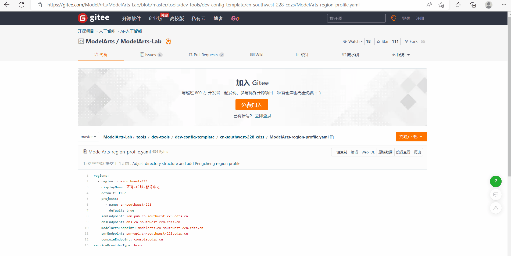
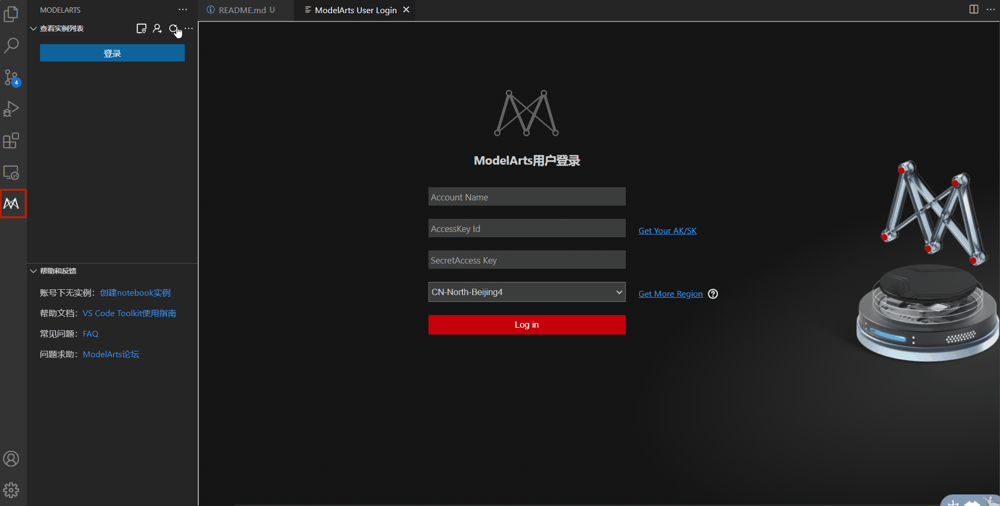
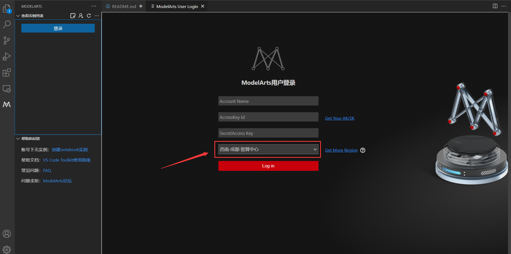
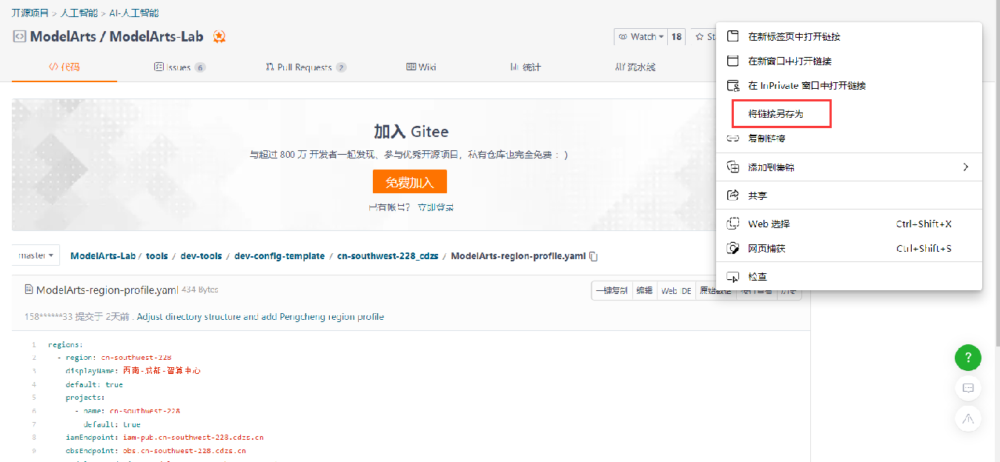
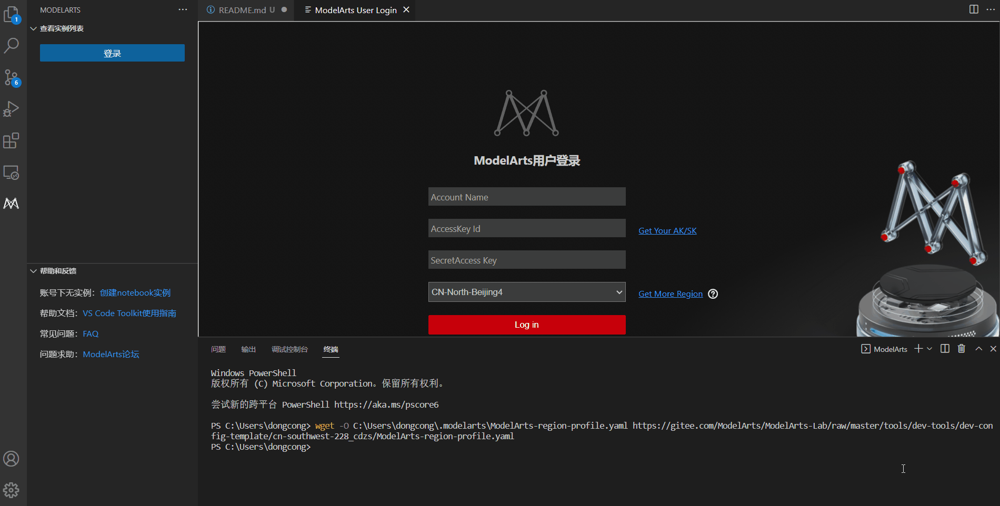

# 如何使用配置文件？
- [如何使用配置文件？](#如何使用配置文件)
  - [VS Code插件中使用配置文件](#vs-code插件中使用配置文件)
    - [1.选择自己的局点进入](#1选择自己的局点进入)
    - [2.查询拷贝git的下载路径](#2查询拷贝git的下载路径)
      - [⚠注意：非华为用户需获取host信息](#注意非华为用户需获取host信息)
    - [3.在VS Code插件中使用配置文件](#3在vs-code插件中使用配置文件)
    - [4.登录VS Code插件获得更多功能](#4登录vs-code插件获得更多功能)
      - [备注：如果配置文件下载成功，但是region不为自己的局点，请点击刷新](#备注如果配置文件下载成功但是region不为自己的局点请点击刷新)
    - [备注：如果无法从git的URL下载配置文件时，执行如下两步](#备注如果无法从git的url下载配置文件时执行如下两步)
## VS Code插件中使用配置文件

### 1.选择自己的局点进入

例子：西南-成都-智算中心:进入目录“cn-southwest-228_cdzs”

### 2.查询拷贝git的下载路径
右击“原始数据” -> 单击“复制链接”

#### ⚠注意：非华为用户需获取host信息
​ 由于插件需要使用API进行接口调用，有些HCSO局点的API域名未注册，因此需要把对应的API域名对应的IP地址配置到本地PC的hosts文件中，该文件一般位于C:\Windows\System32\drivers\etc。以成都局点为例，进入cn-southwest-228_cdzs文件夹下的hosts，然后复制hosts内容追加写入本地PC的C:\Windows\System32\drivers\etc

### 3.在VS Code插件中使用配置文件
点击左侧栏图标打开VSCodec插件 -> 点击“更多操作”中的import Region Profile -> 点击右下角的“网址下载（From url）” -> 输入URL后回车

### 4.登录VS Code插件获得更多功能
配置文件导入成功后，region变为自己的局点，请输入Account Name、AK/SK完成登录操作

#### 备注：如果配置文件下载成功，但是region不为自己的局点，请点击刷新

### 备注：如果无法从git的URL下载配置文件时，执行如下两步
1. 可以右击“原始数据” -> 单击“将链接另存为” -> 保存文件至本地

2. 点击左侧栏图标打开VSCodec插件 -> 点击“更多操作”中的import Region Profile -> 点击右下角的“选择本地文件（From local file）” -> 选择刚刚下载的“ModelArts-region-profile.yaml”文件

